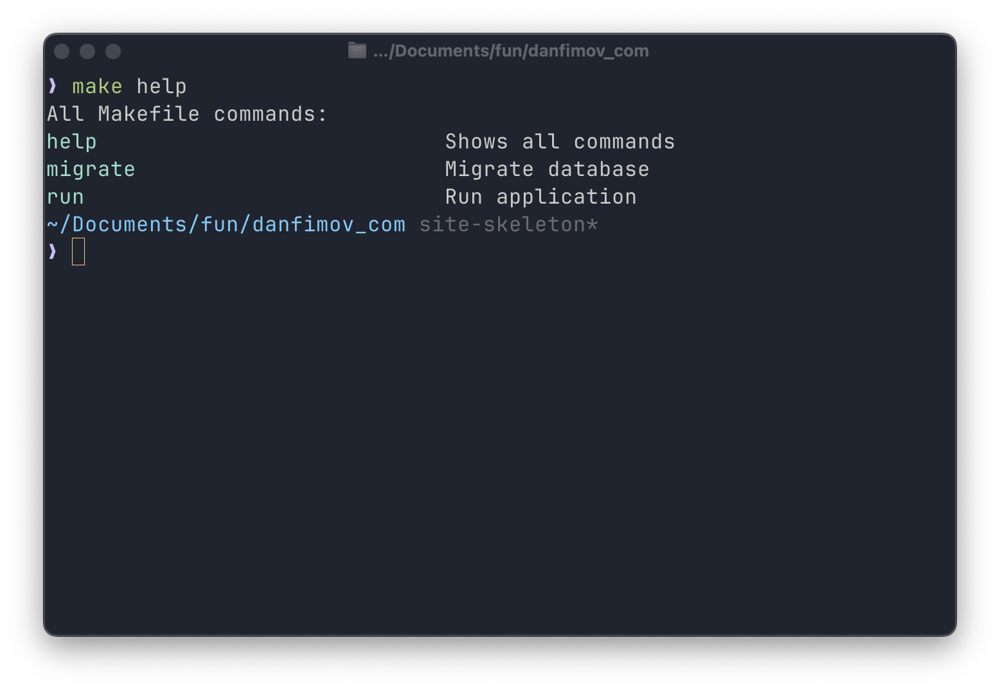
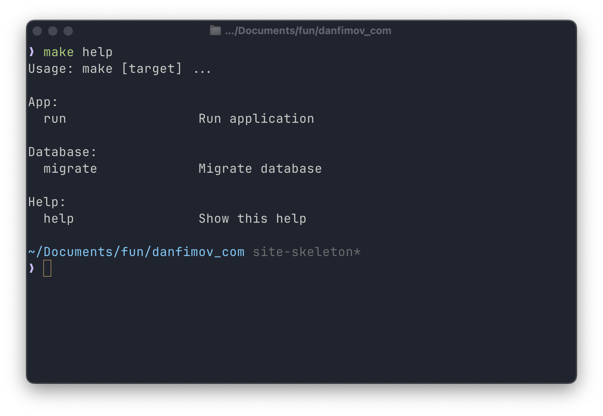
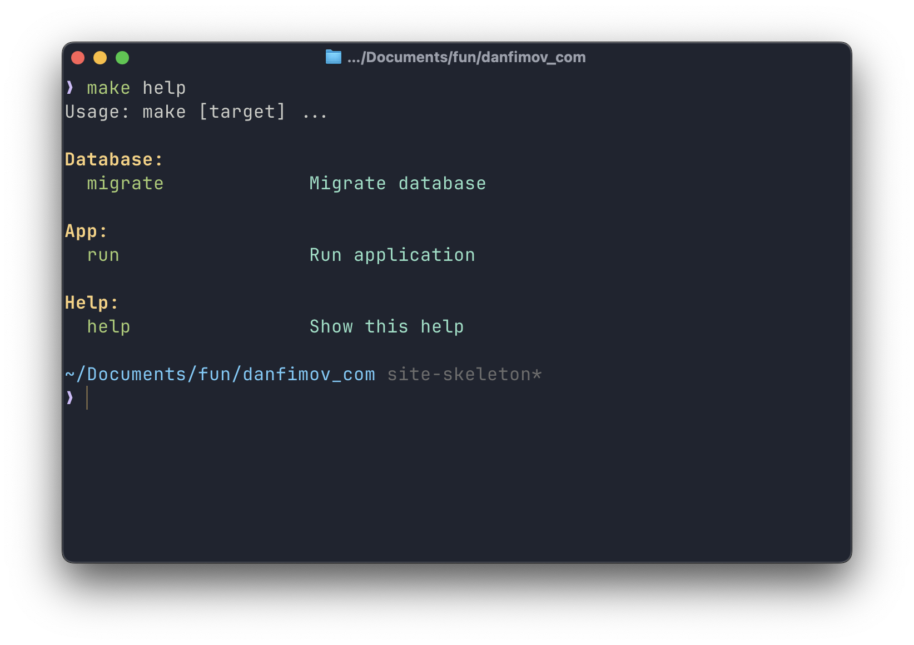

Мне нравится пользоваться Makefile и командами вроде `make buuild/run/whatever`. Их обычно ассоциируют с C++ сборками, но и для проектов на любых других языках они могут оказаться полезны.

Вместо того чтобы запоминать множество различных CLI команд, я могу создать свой понятный интерфейс взаимодействия с проектом в одном файле. Но как обычно - есть нюанс.

## Мне нужна помощь

CLI утилиты неудобны без `help` / `--help`. Любой инструмент командной строки должен иметь возможность подсказать, какие команды доступны.
Проблема в том, что в `Makefile` нет такой возможности из коробки - но никто не мешает её добавить.

### Название и описание команд

На такой вариант решения я натнулся в [блоге Luciano Nooijen](https://lucianonooijen.com/blog/help-makefile/).
Он позволяет получить простой список команд с их описанием:

```make
.PHONY: help
help: ## Shows all commands
	@echo 'All Makefile commands:'
	@grep -h -E '^[a-zA-Z_-]+:.*?## .*$$' $(MAKEFILE_LIST) | awk 'BEGIN {FS = ":.*?## "}; {printf "\033[36m%-30s\033[0m %s\n", $$1, $$2}'
```

Этот код использует `grep` для поиска строк, соответствующих формату команды с комментарием, а затем форматирует их с помощью `awk` с цветной подсветкой.

Чтобы добавить описание к команде используется двойной `#`:

```make
.PHONY: migrate
migrate:  ## Migrate database
	uv run python3 -m speechkit.infrastructure.database.migrations upgrade head
```

Результат будет выглядеть так:



Здорово, можно остановиться здесь, если вам этого достаточно. Но можно пойти чуть дальше.

### Группировка команд

Если у вас много команд в Makefile, имеет смысл сгруппировать их по категориям. Вот более сложный вариант с использованием Perl:

```make
HELP_FUN = \
	%help; while(<>){push@{$$help{$$2//'options'}},[$$1,$$3] \
	if/^([\w-_]+)\s*:.*\#\#(?:@(\w+))?\s(.*)$$/}; \
	print"$$_:\n", map"  $$_->[0]".(" "x(20-length($$_->[0])))."$$_->[1]\n",\
	@{$$help{$$_}},"\n" for keys %help; \

help: ##@Help Show this help
	@echo -e "Usage: make [target] ...\n"
	@perl -e '$(HELP_FUN)' $(MAKEFILE_LIST)
```

Для добавления команды в определенную группу используется специальный формат комментария:

```make
.PHONY: migrate
migrate:  ##@Database Migrate database
	uv run alembic upgrade head
```

Здесь `Database` — название группы, в которую будет включена команда `migrate`.

Результат будет более структурированным:



### Цветное выделение

Для лучшей визуальной организации можно добавить цветной вывод:

```make
YELLOW := \033[33m
GREEN := \033[32m
CIAN := \033[36m
BOLD := \033[1m
RESET := \033[0m

HELP_FUN = \
	%help; while(<>){push@{$$help{$$2//'Others'}},[$$1,$$3] \
	if/^([\w-_]+)\s*:.*\#\#(?:@(\w+))?\s(.*)$$/}; \
	print"$(BOLD)$(YELLOW)$$_:$(RESET)\n", map"  $(GREEN)$$_->[0]$(RESET)".(" "x(20-length($$_->[0])))."$(CIAN)$$_->[1]$(RESET)\n",\
	@{$$help{$$_}},"\n" for keys %help; \
```

Теперь вывод команды `make help` станет более удобочитаемым:



## Обработка некорректных целей

Важная часть хорошего CLI — понятные сообщения об ошибках. Добавим обработку случаев, когда пользователь ошибся в команде:

```make
.DEFAULT:
	@echo "No such command (or you pass two or many targets to ). List of possible commands: make help"
```

Раз уж команда `make help` реализована, то не лишним будет о ней упомянуть в тексте сообщения об ошибке.

Можно пойти дальше и сделать команду `help` запускаемой по умолчанию (когда вызывается просто `make` без аргументов):

```make
.DEFAULT_GOAL := help
```

## Заключение

Хотя существуют более продвинутые инструменты для создания CLI, Makefile - хорошее место для старта.
Надеюсь, пара советов выше поможет сделать ваши make-команды чуть более удобными и понятными.
