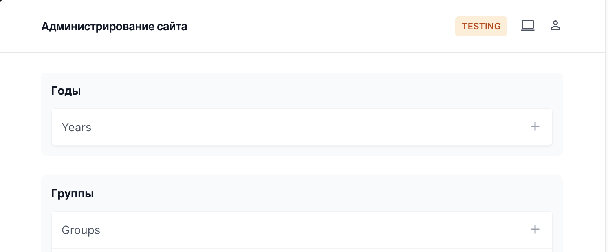

Людей, умеющих делать хорошие интерфейсы, мало. Бекендеров, умеющий делать хорошие интерфейсы - еще меньше.

Эта статья о том, как я, будучи бекендером с минимальными знаниями фронтенд-технологий, справлялся с реализацией интерфейсов и чему успел научиться.

На момент написания статьи я работаю над бекендом LMS Летних школ Яндекса. Код этого проекта - форк кода Яндекс Лицея с натянутым поверх новым UI от команды HR Tech и рядом хаков на стороне бекенда. Отсюда уже можно понять, что в коде куча ненужных вещей и еще больше - костылей чтобы это всё работало.

## Что болит?

Единственный менеджер задолбался руками забивать контент для курсов. Сторонние менеджеры даже с длинными мануалами на внутренней wiki не справлялись с тем, чтобы создавать контент самостоятельно: правильно заполнить 50 полей только чтобы создать курс - это боль, понять, почему он после создания не отображается в интерфейсе - боль еще большая.

Решено было перед следующим набором потратить часть ресурсов на то, чтобы сделать нормальный бек-офис: место, где можно было бы удобно создавать контент без знаний черной магии. Создавать нужно курсы, модули, занятия и заданий внутри занятий. Желательно без ввода лишних и неиспользуемых полей, а также с интуитивно понятным интерфейсом.
### Варианты и ресурсы

Команда состоит из трех человек: бекендера (меня), фронтендера и менеджера. Ресурсов немного, задач перед новым сезоном летних школ хватает. Поэтому нужно делать минимальными усилиями и желательно сразу удобно.

Обсудили варианты, поняли, что есть два пути:

|                              | API + интерфейс                                                                            | Django шаблоны                                                                    |
| ---------------------------- | ------------------------------------------------------------------------------------------ | --------------------------------------------------------------------------------- |
| Ресурсы разработки           | Бекендер + фронтендер                                                                      | Бекендер                                                                          |
| Привычность технологий       | Все знают свои инструменты                                                                 | Бекендер не умеет делать хорошие интерфейсы и почти не работал с django шаблонами |
| Кодовая база                 | Три (Django бекенд + фронт-бек на Node + интерфейс на React), жестко связанные контрактами | Одна (Django бекенд)                                                              |
| Сложность внесения изменений | Нужно будет согласовывать между разработчиками любые изменения.                            | Достаточно внести изменения в одном месте<br>                                     |
| Тесты                        | Для полноценного интеграционного тестирования нужно развернуть фронт + фронт-бек + бекенд  | Тесты для форм и шаблонов можно написать прямо рядом с тестами на API             |

Прикинули, что нам важно было бы быстро вносить правки и прототипировать, накинули недельку к сроками в надежде, что я быстро научусь делать хорошо и на фронте (ха, наивные мы конечно). Разошлись.

Спустя три часа я задумался "блин, а формы есть в обычной django админке. может их как-нибудь кастомизируем?". За 20 минут накидал прототип:


Вроде есть потенциал: присутствуют только  нужные поля с группировка по тематике, виджетами можно упростить редактирование json-полей, а названия сделать человекочитаемыми. "Дешево и сердито" - идеально описывает ситуацию. Прикинули, что можно ~~натянуть сову на глобус~~ кастомизацией форм сделать юзабельно и приняли этот вариант.

## Делаем красиво

Стандартная панель администратора Django далека от современных интерфейсов. Как минимальными усилиями это поправить? Подключить библиотеку с нормальным UI!

Оказалось, что популярных вариантов не так много: django-unfold, django-jazzmin и django-suit. Сравнение их фич можно найти в [документации django-unfold](https://unfoldadmin.com/django-admin-themes-comparison)

Мне подошел django-unfold по нескольким причинам:
1) Самый современный интерфейс среди конкурентов;
2) Библиотека компонентов, которые можно использовать на своих кастомных страничках. Для моей задачи пригодилось бы;
3) Удобные инструменты: htmx и tailwind. К этому я вернусь позже на этапе кастомизации.

Окей, добавляем в зависимости и, после прохода по [гайду для подключения из документации](https://unfoldadmin.com/docs/installation/quickstart/), смотрим, что еще нужно подправить.

### Замена привычным инструментам

Главное приемущество django-unfold в том, что эта библиотека включает в себя ряд фунций из более специфичных библиотек. Например, чтобы понять, в каком окружении сейчас работает админка, я обычно использовал библиотеку [django-env-notice](https://github.com/dizballanze/django-admin-env-notice) - она добавляет плашку в зависимости от env-переменных:


В django-unfold есть похожий механизм, позволяющий задать бейдж через опции в настройках. Достаточно указать в настройках функцию, откуда мы будем брать текст и цвет бейджа:
```python
UNFOLD = {
	...
	"ENVIRONMENT": "sample_app.environment_callback",
}


def environment_callback(request) -> list[str, str]:
    """
    Должен возвращать текст и цвет
    """
    return [
	    "Production",
	    "danger"  # доступы значения info, danger, warning, success
	]
```

Выглядит это так:



### Заменяем (почти) все кастомные фильтры

В документации django-unfold есть целый [раздел про фильтры](https://unfoldadmin.com/docs/filters/introduction/). Фильтр по дате и времени убирает необходимость в использовании [django-admin-rangefilter](https://github.com/silentsokolov/django-admin-rangefilter):

```python
from rangefilter.filters import (
    DateRangeFilterBuilder,
    DateTimeRangeFilterBuilder,
)

@admin.register(Example)
class ExampleAdmin(ModelAdmin):
    list_filter = (
        ("created_at", DateRangeFilterBuilder()),
        ("updated_at", DateTimeRangeFilterBuilder()),
    )


# Меняем на

from unfold.contrib.filters.admin import RangeDateFilter, RangeDateTimeFilter


@admin.register(Example)
class ExampleAdmin(ModelAdmin):
    list_filter = (
        ("created_at", RangeDateFilter()),
        ("updated_at", RangeDateTimeFilter()),
    )
```
Аналогично реализация текстового фильтра из библиотеки заменила собой мою собственную.

Но есть неприятный нюанс использования фильтров. Фильтры в django-unfold - это форма, в которой по-умолчанию нет кнопки "Применить". Это отлично работает с полями, где есть фиксированное множество возможных значений (boolean, например), но вообще не работает с текстом (в данном примере есть одно текстовое поле с названием курса):


Оказалось, что для появления кнопки "применить фильтры", нужно добавить:

```python
@admin.register(Course)
class CourseAdmin(ModelAdmin):
    form = CourseForm
    list_filter_submit = True  # add "Apply Filters" button
```

Теперь работает:


Почему эта опция не включена по умолчанию - не очень понятно. Пришлось наследовать модели в админке от своего класса, где эта опция включена по-умолчанию.

### А порядок меняете? Не, только показываем

В django-unfold есть очень удобная фича - возможность drag-n-drop сортировки inline объектов (aka [sortable inlines](https://unfoldadmin.com/docs/inlines/sortable/)):


Одна проблема. Если вы используйте в проекте пакет [django-ordered-model](https://github.com/django-ordered-model/django-ordered-model), работать это не будет. Проблема в том, что поле для хранения порядка по умолчанию создается с `editable=False`, что мешает менять order напрямую:

```python
class OrderedModel(OrderedModelBase):
    """
    An abstract model that allows objects to be ordered relative to each other.
    Provides an ``order`` field.
    """

    order = models.PositiveIntegerField(_("order"), editable=False, db_index=True)
```

Решение в этом случае может быть простым - написать свой миксин с `editable=True`. В моем случае я вообще решил избавить от этой библиотеки, так как она использовалась в большинстве случаев как раз для подключения возможности изменения order в админке (стрелочками up/down). Минус одна зависимость - плюс в сторону django-unfold.

### Заменяем кастомные действия

Разумеется для некоторых моделей в админке были написаны свои кастомные действия (aka actions) с использованием `django_object_actions`. Проблема в том, что они криво отображаются в новом интерфейсе, так как django-unfold использует [свою реализацию для actions](https://unfoldadmin.com/docs/actions/introduction/) и не поддерживает что-то кроме неё:


Реализация из django-unfold не позволяет сделать операции сразу над несколькими сущностями, потому что на вход в action передается лишь id объекта. Даже если вы вызвали действие для пачки сущностей - функция будет вызвана для каждой сущности отдельно.

Это может быть проблемой для тяжеловесных операций, но в случае моего проекта - я просто переписал все балковые операции на реализацию для каждого отдельного элемента и спокойно убрал из зависимостей `django-object-action`.

### Главное должно быть рядом

Окей, современно выглядящие стили  - натянули, сломанное в процессе "реновации" - починили. Но удобнее не стало от слова совсем.

Подумаем над базовым сценарием - создание занятия. Заходит методист в админку - куда дальше? Пойдем искать в длинном списке сущностей "занятия"? Удачи, она называется `Lessons`, находится ближе к концу страницы (замучаешься скроллить) и содержит `Lessons`, `LessonVariant`, `LessonGroups` и прочие вещи, которые ставят в ступор. Надо править.

Чтобы было удобно, нужно, чтобы в навигации по одному клику должны быть самые нужные вещи:

- Курсы, уроки и прочее - для методиста;
- Пользователи и их группы - для менеджера;
- Celery - для ~~меня любимого~~ разработчика.

Плюс, лучше не показывать, чем Летние Школы не пользуются: приглашения, расписание занятий, семестры и много чего еще, что было полезно в Лицее, но бессмысленно для нас.

Как добиться подобного с [настройками unfold](https://unfoldadmin.com/docs/configuration/settings/):
```python
UNFOLD = {
	...
    "SIDEBAR": {
        "show_search": True,  # Search in applications and models names
        "show_all_applications": True,  # Dropdown with all applications and models
        "navigation": [
            {
                "title": _("Бэк-офис"),
                "separator": True,  # Top border
                "collapsible": False,  # Collapsible group of links
                "items": [
                    {
                        "title": _("Курсы"),
                        "icon": "import_contacts",  # Supported icon set: https://fonts.google.com/icons
                        "link": reverse_lazy("admin:course_course_changelist"),
                    },
                    ...
                ],
            },
            {
                "title": _("Пользователи & Группы"),
                "collapsible": True,
                "items": [
                    {
                        "title": _("Users"),
                        "icon": "person",
                        "link": reverse_lazy("admin:account_user_changelist"),
                    },
                    ...
                ],
            },
            ...
        ],
    }
}
```

Очень радует в данном случае, что можно указать ссылки на произвольные странички - от list view до кастомных страниц в админке и вне её. Удобно!

### Локализация - это важно

По мере необходимости стоит локализовать админку. Очень неудобно, когда пользователю админки надо думать "а мне нужно искать 'занятия' или 'lessons'?". Отнимает время и нервы, но не критично.

Даже в среднем по размерам проекте локализовать всё - боль. Надо добавить всем моделям `Meta->verbose_name` и `Meta->plural_name`, зайти в `.po` файл и добавить новые пары слово-перевод, перекомпилировать файлы с переводом из `.po` в `.mo`. Поэтому стоит начать с наиболее часто используемых приложений, а остальное переводить по мере необходимости.

В итоге получилось такое:


Всё еще есть куда стремиться, но по крайней мере навигация теперь приносит в разы меньше боли.

## Кастомные страницы в админке

Сайд-квест с натягиванием стилей на всю админку закончился. Пришло время делать самое сложное и полезное - функционал для создания учебных материалов.

Расскажу, как я ломал голову над интерфейсом на примере умеренно сложной странички с отображением структуры курса. Требования сформулированы примерно так:
- Курс состоит из модулей, в каждом модуле - занятия, в занятиях - задачи (получается три уровня вложенности);
- Нужно уметь отображать полное дерево - структуру курса на одной страничке без дополнительных кликов;
- Должно быть легко менять порядок задач в занятии (желательно drag-n-drop, но можно и просто стрелочками);
- Должно быть легко проваливаться в редактирование сущности (модуля, занятия, задания).
### Откуда брать интерфейс

Для начала неплохо было бы понять, а как моё поделие должно выглядеть. Дизайнера под рукой нет, на курсы дизайна или UI/UX нет ни денег, ни времени. Я решил обратиться к тем инструментам, что уже есть в проекте - и взял в качестве вдохновения django-unfold. Что там используется под капотом?


Во-первых, хочется, чтобы было красиво - значит посмотрим на TailwindCSS.

> Дисклеймер: я еще со времен универа знаком с html/css. Для тех, кто еще не успел - рекомендую для начала ознакомиться с базой, а уже потом идти изучать инструменты вроде Tailwind. Потому что не зная, как вообще работают стили, довольно сложно использовать классы оттуда.

TailwindCSS удобен тем, что у него из коробки доступны фичи, чтобы быстро делать красиво:
- Zero configuration start. Для начала вообще не нужно ничего настраивать. Базовых стилей будет вполне достаточно, о переиспользовании и кастомизации можно подумать позже;
- Есть своя красивая палитра сочетающихся цветов (в моем случае я просто подсмотрел, что используется в django-unfold);
- Есть своя понятная размерная сетка.

Для Django шаблонов Tailwind особенно удобен тем, что не нужны отдельные файлы со стилями, можно просто написать всё в одном html-файле. Подключение тоже не составляет проблем, можно почитать [гайд на FreeCodeCamp](https://www.freecodecamp.org/news/how-to-integrate-tailwind-with-django/), например.

Во-вторых, хочется, чтобы было удобно. А что вообще значит удобно? Здесь мне под руку попалась книга ["Refactoring UI"](https://www.refactoringui.com/), которую так рекомендуют создатели Tailwind. Не поленюсь оставить ссылку на [Library Genesis](https://libgen.is/book/index.php?md5=C0008A5B7285DD078C6AFC3F5881B06D), потому что цена прочтения - один вечер, а умение аргументировано сказать, почему UX на странице так себе - бесценно.

В-третьих, не хочется придумывать весь стиль с чистого листа. С этим мне помогли три вещи:

1) django-unfold с его компонентами и дешбордом из [демо приложения](https://demo.unfoldadmin.com/en/admin/). Компоненты позволяют переиспользовать привычные поля ввода и кнопочки, а дешборд позволяет понять, какие полезные элементы для организации пространства могут быть на страничке (например, блоки с обводкой и заголовками).

   

2) [bolt.new](https://bolt.new/) с его бесплатным демо, позволяющим быстро накидать интерфейс с помощью промптов. Я так, например, быстро накидал интерфейс для отображения структуры курса. Для меня этот инструмент работает только в качестве заполнителя пустого листа. Код на нужном стеке и с нужными технологиями всё равно нужно писать ручками (не надо пытаться заставить AI сделать это за вас - зря потратите токены и время).

   

3) Библиотеки готовых компонентов с использованием tailwind. Например, [Tailblocks](https://tailblocks.cc/). Я подсматривал оттуда, как можно использовать привычные для пользователя компоненты, чтобы отображать полезную информацию в админке.

Вооружившись документацией, ворохом компонент и приемов из книги я наваял такое:


Не скажу, что полностью рад получившемуся интерфейсу, но я точно сделал лучше после прочтения книги. Теперь я могу аргументировать, почему интерфейс сделан так, как сделан:
- Модули я выделил рамкой и написал заголовки на цветной области, чтобы они стали самым заметным контейнером;
- Заголовки занятий выделил жирным, чтобы отделить их от заголовков задач;
- Задачи явно выделил с помощью цвета фона и добавив точки слева, чтобы пользователю было понятно, что это перетаскиваемые элементы;
- Второстепенную информацию, вроде баллов и дедлайнов написал тонким шрифтом, чтобы отделить её от более важной;
- Теги разделил цветами, чтобы явно видеть, где есть задачи с оценкой, а где нет.

### Делаем интерактивно

Хорошо, про UI подумали, но надо же, чтобы всё это еще и сохранялось при редактировании или чтобы что-то менялось на страничке в зависимости от ввода пользователя. А как? Расскажу на примере странички с настройкой доступности курса для групп учеников. Выглядит она так:


Слева - список групп. При клике на настройки группы справа появляются настройки видимости занятий в курсе. Что нас интересует, так это поле поиска, где можно найти группу по названию. Для такого сценария вполне подходит htmx.

> HTMX - это JavaScript библиотека, которая позволяет получать доступ к современным возможностям браузера (AJAX, CSS Transitions, WebSockets и Server Sent Events) напрямую через HTML атрибуты, без необходимости писать JavaScript код. Это позволяет создавать динамические веб-интерфейсы более простым и декларативным способом, следуя философии HTML-first.

> Примеры использования HTMX:

> 1. Динамическая подгрузка контента без перезагрузки страницы (бесконечная прокрутка, подгрузка комментариев)
>2. Живой поиск с автодополнением
>3. Формы с мгновенной валидацией
>4. Динамическое обновление части страницы (например, счетчик лайков)
>5. Модальные окна с динамическим содержимым

В данном случае я использовал htmx для того, чтобы при вводе названия группы в поле, делать поисковый запрос и менять список ниже таким образом, чтобы там отображались только подходящие группы.

Чтобы это работало, нужно для начала добавить вызов API по изменению состоянию input-а:
```html
<input
    type="text"
    placeholder="Введите название группы"
    hx-get=""
    hx-trigger="input changed delay:500ms"
    hx-target="#group-list"
    hx-swap="innerHTML"
    name="search"
    hx-vals="{'search': this.value}"
>

```

Затем обработать сам запрос:
```python
def search_group_by_name(request, course_id: int):
    course = get_object_or_404(Course, id=course_id)
    groups = Group.objects.filter(name__icontains=request.GET['search']).all()
    context = {
        'course': course,
        'groups': groups,
    }
    return render(
        request,
        template_name="group/partial/visibility.html",
        context={
            **context,
            **admin_site.each_context(request),
        },
    )
```

И вернуть html-шаблон, который заменит элементы списка с группами:
```html
<ul id="group-list" class="space-y-2">
    
        <li>
	        <p>{{ group.name }}</p>
        </li>
    
</ul>
```

Выглядит сильно проще, нежели писать что-то подобнлн на JQuery или на ванильном JavaScript. А главное - работает.

### Мелочь, а приятно

Еще расскажу о маленьком пасхальном яйце, которое успел добавить просто потому что.

Авторизация в админку всегда была вещью, до которой руки не доходили никогда. Эту страничку большинство людей из команды видят ровно один раз, пишут в чат "ой, а дайте доступ", проходят авторизацию и забывают о ней до конца своей работы на проекте. Так она выглядела до всех правок:


Но я эту страничку вижу довольно часто - особенно на тестовых стендах, когда нужно убедиться, что изменения в админке ничего не сломали. Поэтому сделал себе (и чуть реже - другим) приятное - заменил стандартное сообщение с просьбой залогиниться на вот такой виртуальный бейдж сотрудника:


Срисовывал с настоящего бейджа:


Стало чуть более душевно, как мне кажется.

## Время подвести итоги

За время работы над задачей по созданию бэк-офиса я вынес для себя несколько важных уроков:

- Готовых решений не бывает, их всё еще надо допиливать напильником под свой проект. Django-unfold дает современный UI и набор полезных компонентов "из коробки", но внедрять его в проект, который давно развивается, может быть непросто.

- Важно думать об удобстве конечного пользователя. Локализация интерфейса, продуманная навигация и группировка функционала сделали админку значительно удобнее для создателей учебного контента.

- При отсутствии дизайнера можно создавать приличные интерфейсы, опираясь на:

    * Готовые библиотеки компонентов;
    * Базовые принципы UI/UX из книг вроде "Refactoring UI";
    * Существующие решения как источник вдохновения.

- HTMX + TailwindCSS оказались отличными инструментами для бэкенд-разработчика. Они позволяют создавать интерактивные и удобные интерфейсы без глубокого погружения во фронтенд-разработку.

В итоге  получился удобный инструмент для работы с контентом, который не требует специальных знаний от пользователей. А я получил ценный опыт создания интерфейсов.
