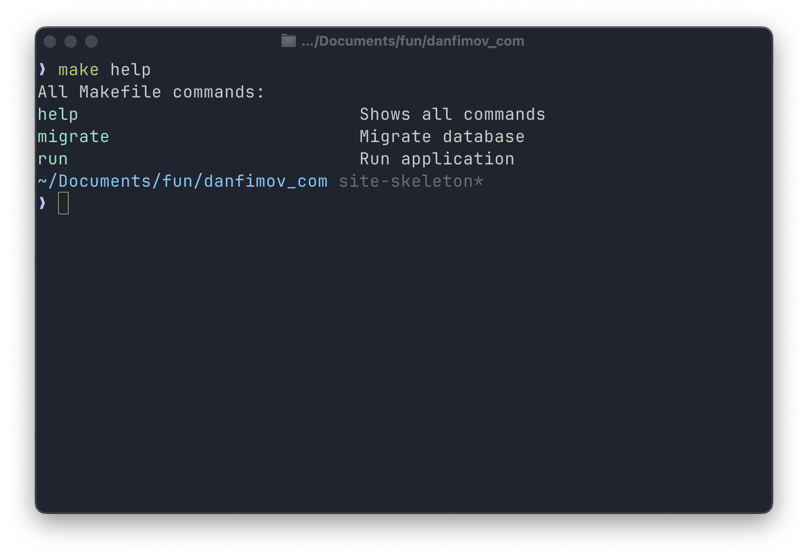
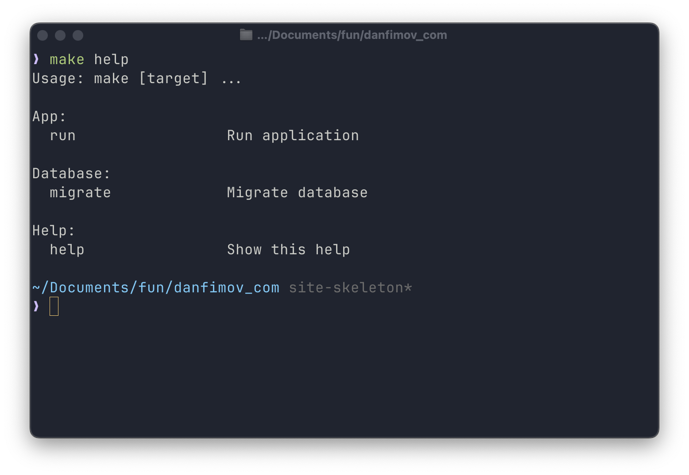
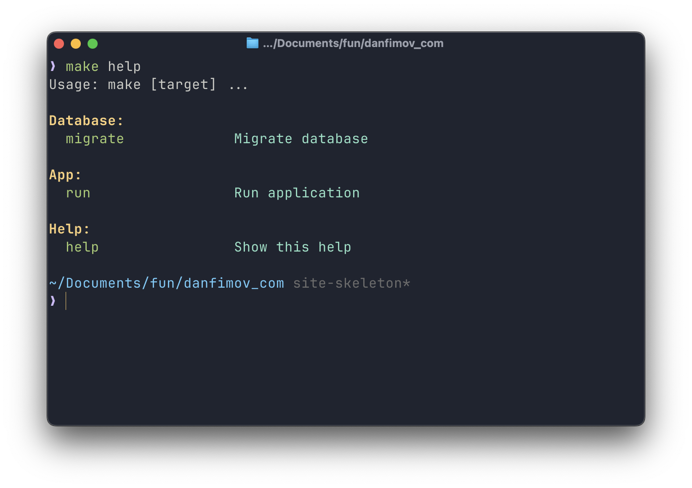

I like using Makefiles with commands like `make build/run/whatever`. They're usually associated with C++ builds, but they can be just as useful for projects in any other language.

Instead of memorizing a bunch of different CLI commands, I can build my own clear interface for interacting with a project, all in a single file. And reuse it for every project. For example I have `make init` in every repo there I to create virtual env and install banch of things for local development. Saves my brain some resources for something more useful.

But, as usual, there's a catch.

## I need help

CLI tools are awkward to use without `help` / `--help`. Any command-line tool should be able to tell you which commands are available.
The problem is that `Makefile` doesn't offer this out of the box - but nothing stops you from adding it.

### Command names and descriptions

I came across this solution in [Luciano Nooijen's blog](https://lucianonooijen.com/blog/help-makefile/).
It lets you produce a simple list of commands along with their descriptions:

```makefile
.PHONY: help
help: ## Shows all commands
	@echo 'All Makefile commands:'
	@grep -h -E '^[a-zA-Z_-]+:.*?## .*$$' $(MAKEFILE_LIST) | awk 'BEGIN {FS = ":.*?## "}; {printf "\033[36m%-30s\033[0m %s\n", $$1, $$2}'
```

This code uses `grep` to find lines matching the format of a command with a comment, and then formats them with `awk`, adding colored highlighting.

To add a description to a command, use a double `#`:

```makefile
.PHONY: migrate
migrate:  ## Migrate database
	uv run python3 -m speechkit.infrastructure.database.migrations upgrade head
```

The result looks like this:



Nice - you can stop here if that's enough for you. But we can take it a bit further.

### Grouping commands

If you have a lot of commands in your Makefile, it makes sense to group them by category. Here's a more advanced version using Perl:

```makefile
HELP_FUN = \
	%help; while(<>){push@{$$help{$$2//'options'}},[$$1,$$3] \
	if/^([\w-_]+)\s*:.*\#\#(?:@(\w+))?\s(.*)$$/}; \
	print"$$_:\n", map"  $$_->[0]".(" "x(20-length($$_->[0])))."$$_->[1]\n",\
	@{$$help{$$_}},"\n" for keys %help; \

help: ##@Help Show this help
	@echo -e "Usage: make [target] ...\n"
	@perl -e '$(HELP_FUN)' $(MAKEFILE_LIST)
```

To add a command to a specific group, use a special comment format:

```makefile
.PHONY: migrate
migrate:  ##@Database Migrate database
	uv run alembic upgrade head
```

Here `Database` is the name of the group that the `migrate` command will be added to.

The result is more structured:



### Color highlighting

For better visual organization, you can add colored output:

```makefile
YELLOW := \033[33m
GREEN := \033[32m
CIAN := \033[36m
BOLD := \033[1m
RESET := \033[0m

HELP_FUN = \
	%help; while(<>){push@{$$help{$$2//'Others'}},[$$1,$$3] \
	if/^([\w-_]+)\s*:.*\#\#(?:@(\w+))?\s(.*)$$/}; \
	print"$(BOLD)$(YELLOW)$$_:$(RESET)\n", map"  $(GREEN)$$_->[0]$(RESET)".(" "x(20-length($$_->[0])))."$(CIAN)$$_->[1]$(RESET)\n",\
	@{$$help{$$_}},"\n" for keys %help; \
```

Now the output of `make help` becomes much more readable:



## Handling invalid targets

An important part of a good CLI is clear error messages. Let's add handling for cases where the user mistypes a command:

```makefile
.DEFAULT:
	@echo "No such command (or you pass two or many targets to ). List of possible commands: make help"
```

Since the `make help` command is already implemented, it doesn't hurt to mention it in the error message text.

You can go one step further and make `help` the command that runs by default (when you call just `make` with no arguments):

```makefile
.DEFAULT_GOAL := help
```

## Conclusion

Although there are more advanced tools for building CLIs, a Makefile is a good place to start.
I hope the few tips above help make your make commands a little more convenient and easier to understand.
